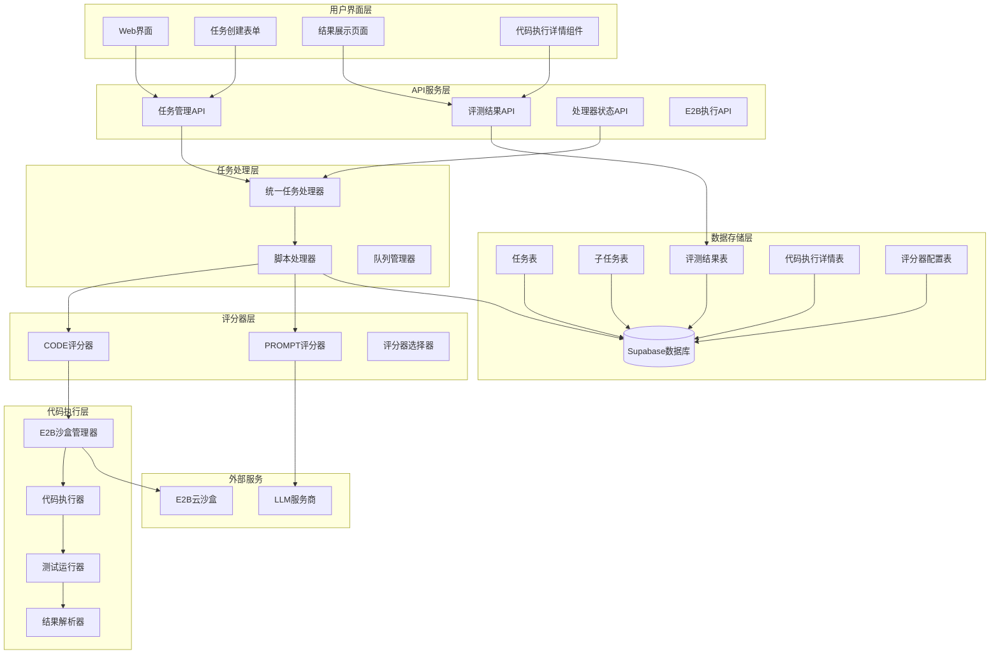
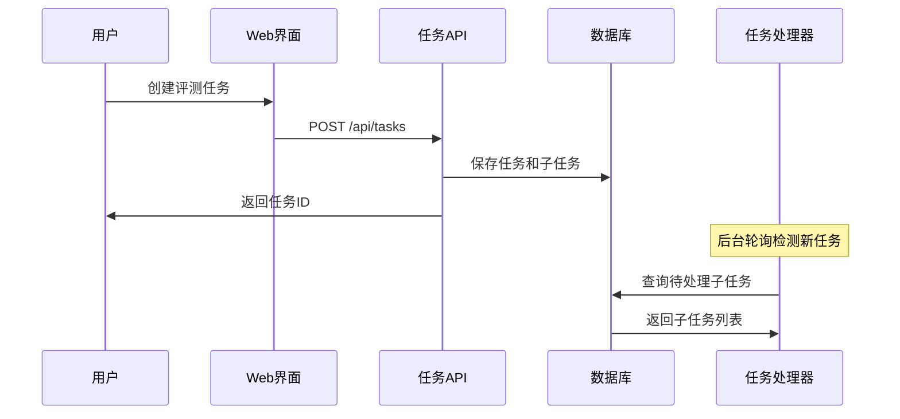
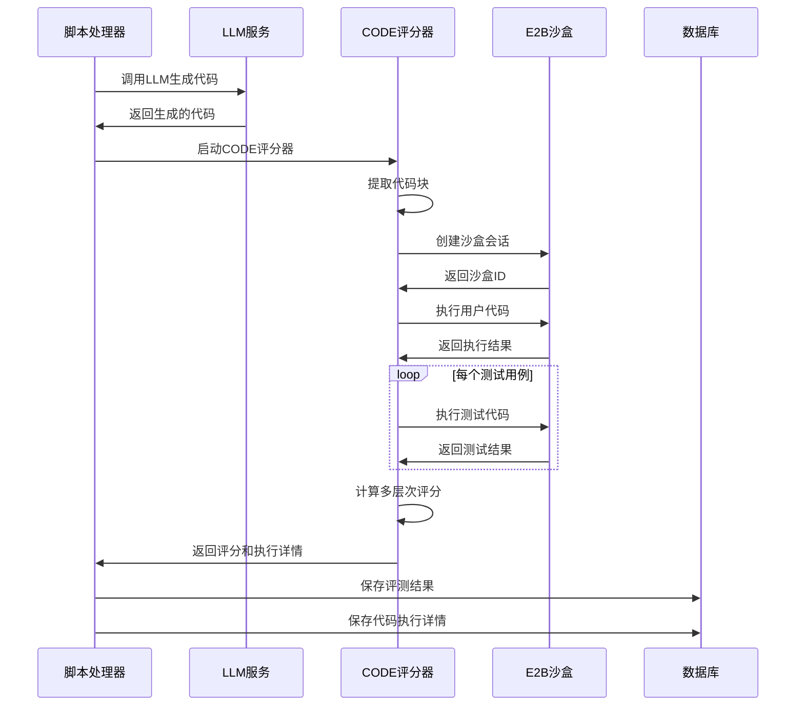
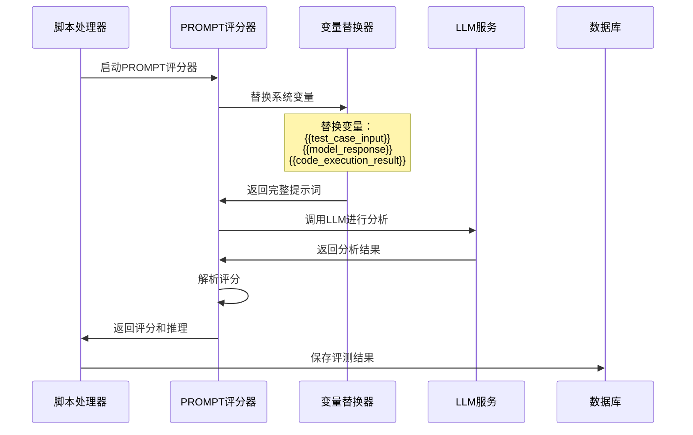

# E2B代码执行系统技术架构

## 🏗️ 系统架构概览



## 🔄 代码执行工作流程

### 1. 任务创建阶段



### 2. CODE评分器执行阶段



### 3. PROMPT评分器执行阶段



## 🗄️ 数据库表结构

### 核心表结构

```sql
-- 任务表
CREATE TABLE tasks (
    id UUID PRIMARY KEY DEFAULT gen_random_uuid(),
    name TEXT NOT NULL,
    status TEXT DEFAULT 'pending',
    config JSONB,
    created_at TIMESTAMP WITH TIME ZONE DEFAULT NOW(),
    updated_at TIMESTAMP WITH TIME ZONE DEFAULT NOW()
);

-- 子任务表
CREATE TABLE subtasks (
    id SERIAL PRIMARY KEY,
    task_id UUID REFERENCES tasks(id),
    model_id UUID,
    evaluator_id UUID,
    test_case_id UUID,
    status TEXT DEFAULT 'pending',
    score INTEGER,
    justification TEXT,
    created_at TIMESTAMP WITH TIME ZONE DEFAULT NOW(),
    updated_at TIMESTAMP WITH TIME ZONE DEFAULT NOW()
);

-- 评测结果表
CREATE TABLE evaluation_results (
    id SERIAL PRIMARY KEY,
    subtask_id INTEGER REFERENCES subtasks(id),
    score INTEGER NOT NULL,
    justification TEXT,
    status TEXT DEFAULT 'pending',
    system_variables JSONB,
    scoring_details JSONB,
    created_at TIMESTAMP WITH TIME ZONE DEFAULT NOW()
);

-- 代码执行详情表
CREATE TABLE code_execution_details (
    id SERIAL PRIMARY KEY,
    evaluation_result_id INTEGER REFERENCES evaluation_results(id),
    sandbox_id TEXT,
    stdout TEXT,
    stderr TEXT,
    execution_time_ms INTEGER,
    memory_usage_mb REAL,
    exit_code INTEGER,
    test_results JSONB,
    files_created TEXT,
    created_at TIMESTAMP WITH TIME ZONE DEFAULT NOW()
);

-- 评分器配置表
CREATE TABLE evaluators (
    id UUID PRIMARY KEY DEFAULT gen_random_uuid(),
    name TEXT NOT NULL,
    type TEXT NOT NULL, -- 'CODE', 'PROMPT', 'REGEX', 'HUMAN'
    config JSONB NOT NULL,
    created_at TIMESTAMP WITH TIME ZONE DEFAULT NOW(),
    updated_at TIMESTAMP WITH TIME ZONE DEFAULT NOW()
);
```

### 关键字段说明

**code_execution_details表**：
- `sandbox_id`: E2B沙盒会话ID
- `stdout`: 代码执行的标准输出
- `stderr`: 代码执行的错误输出
- `execution_time_ms`: 总执行时间（毫秒）
- `memory_usage_mb`: 内存使用量（MB）
- `exit_code`: 进程退出代码（0表示成功）
- `test_results`: 测试结果详情（JSON格式）

**evaluators表config字段**（CODE类型）：
```json
{
  "language": "python",
  "timeout": 30000,
  "testCases": [
    {
      "name": "基本功能测试",
      "description": "测试斐波那契数列第10项",
      "input": "10",
      "expectedOutput": "55"
    }
  ],
  "testCodeTemplate": "# 测试代码模板..."
}
```

## 🔧 核心组件详解

### E2B沙盒管理器

**职责**：
- 管理E2B沙盒会话的创建和销毁
- 控制并发沙盒数量
- 处理沙盒超时和错误

**关键方法**：
```typescript
class E2BSandboxManager {
  async createSession(metadata: SessionMetadata): Promise<SessionInfo>
  async executeCode(sessionId: string, code: string): Promise<ExecutionResult>
  async destroySession(sessionId: string): Promise<void>
  async getSystemStatus(): Promise<SystemStatus>
}
```

### 代码执行器

**职责**：
- 执行用户代码和测试代码
- 解析执行结果
- 计算性能指标

**关键方法**：
```typescript
class CodeExecutor {
  async executeAndEvaluate(code: string, testCases: TestCase[]): Promise<EvaluationResult>
  private extractCodeBlocks(response: string, language: string): string
  private buildTestCode(mainCode: string, testCase: TestCase): string
  private parseOutput(stdout: string): TestResult
}
```

### 多层次评分器

**评分算法**：
```typescript
function calculateScore(evaluationResult: EvaluationResult): number {
  let score = 0;
  
  // 语法层 (0-50分)
  if (evaluationResult.success && !evaluationResult.stderr) {
    score += 50;
  }
  
  // 功能层 (0-50分)
  const testsPassed = evaluationResult.testsPassed || 0;
  const testsTotal = evaluationResult.testsTotal || 1;
  score += Math.round((testsPassed / testsTotal) * 50);
  
  // 性能层 (0-10分)
  const executionTime = evaluationResult.executionTime || 0;
  if (executionTime > 0 && executionTime < 5000) {
    const performanceBonus = Math.max(0, 10 - Math.floor(executionTime / 500));
    score += performanceBonus;
  }
  
  return Math.min(score, 100);
}
```

## 🔌 API接口规范

### 主要端点

```typescript
// 任务管理
POST   /api/tasks                    // 创建任务
GET    /api/tasks/{id}              // 获取任务详情
GET    /api/tasks/{id}/subtasks     // 获取子任务列表

// 评测结果
GET    /api/evaluation-results/{id}/code-details  // 获取代码执行详情

// E2B执行
POST   /api/e2b/execute             // 直接执行代码
GET    /api/e2b/execute?action=health  // 健康检查

// 处理器状态
GET    /api/processor               // 获取处理器状态
```

### 响应格式

**代码执行详情响应**：
```json
{
  "success": true,
  "data": {
    "code_execution_details": {
      "sandbox_id": "session_1754103637454_45f3zhifp",
      "stdout": "测试输出内容",
      "stderr": "",
      "execution_time_ms": 1200,
      "memory_usage_mb": 15.3,
      "exit_code": 0,
      "test_results": {
        "passed": 3,
        "total": 3,
        "syntax_correct": true,
        "functional_correct": true
      }
    }
  }
}
```

## 🚀 性能优化策略

### 1. 沙盒会话复用
- 实现沙盒池管理
- 减少创建/销毁开销
- 提高并发处理能力

### 2. 并行处理
- 多个子任务并行执行
- 异步处理机制
- 队列优化

### 3. 缓存机制
- 代码执行结果缓存
- 模板编译缓存
- 数据库查询优化

### 4. 监控和告警
- 执行时间监控
- 错误率统计
- 资源使用监控

---

## 📝 更新记录

- **2025-08-02**: 完成E2B代码执行系统架构设计和实现
- **2025-08-02**: 添加多层次评分机制和详细监控
- **2025-08-02**: 完善数据库表结构和API接口规范
